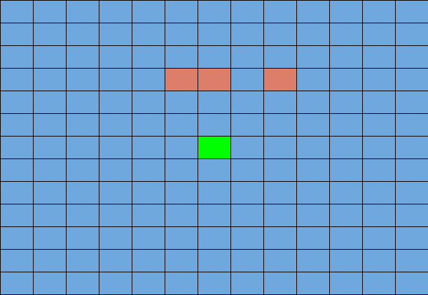

## Video


[](https://www.youtube.com/watch?v=_aAcyVQRYUA)


## Project Summary

The goal of StevesFightClub is to create an agent that is able to fight and defeat all sorts of Minecraft mobs.  The agent fights up to 3 enemies in a 13x13 enclosed arena. The time limit was increased to 50 seconds to acommodate for increase in enemies. We initially wanted to make a wide arena with no bounds, but that would be too trivial since the agent would retreat indefinitely. We chose to make the arena as small as possible to confine the agent into making the best choices possible in a constrained environment.

Our final version focuses primarily on improved movement. We added several new states and modifications to rewards for this to happen. These changes are discussed in the states and rewards approach section of this report.


## Approaches

In our first approach, our agent only knew how to attack while looking at the nearest enemy and could not move. This would be the baseline for our project. 

Later, we implemented tabular Q-learning for our agent because it would help our agent to improve and get better rewards. It could take actions such as attacking, moving forwards/backwards, and strafing left/right. 
We tried to store states as a string representing coordinates of the agent and enemies, but the results were appalling (see results in Figure 1). 

**Environment**



Initially, we had two enemies in the arena. The agent learned it didn't need to move and repeatedly spam attacks. In our final version, we improved our state space to get better movement.  In order to test these changes, we decided to increase the number of enemies to 3. In our previous version, the agent would die repeatedly as it tried to stay at one position and spam attacks on 3 enemies. This was simply because the 3 zombies would outdamage the agent's health bar before the agent was able to kill all 3 enemies. The states space discussed below describes the movement changes that helps the agent survive.


**Learning Algorithm**

Our agent includes a simple Q table approach and it updates as follows:

```
old_q = q_table[prev_s][prev_a]
new_q = old_q + alpha * (reward + gamma * max(q_table[current_state]) - old_q)

alpha is the learning rate
gamma is the discount factor
```


For our final approach, we kept the use of Q-tables and changed what kind of states were stored in the table. We decided the important factors were: distance to the nearest enemy, position in relation to the arena walls, if the agent was looking at the enemy, and amount of health left for the agent. 

We tried to implement shields for our agent to use, but Malmo's inventory items does not seem to have a way to equip something to the off-hand slot when the mission starts. It was unsuitable for the agent to swap to the shield, block an attack, then swap back to the sword, especially when the enemy was right next to the agent. 


**States**


In our initial states, we stored x and z coordinates, but we decided that it would be better to store positions, such as being near the wall or the corner of the arena. This turned out to not be enough, because the agent had no information about the direction it was facing in relation to the wall or corner.  So if it would learn a certain response to being near a wall, say to move left away from the wall, if it encountered a wall to the left in another instance and needs to move right to get away and fails, it would quickly unlearn that response.  


We had two options for a solution. One was to introduce wall states as additions to the current position states of {wall, corner, nothing}.  The wall states would be something like: wall_left, wall_right, wall_front, wall_back.  Additionally, there would be corner states; only two would be needed: corner_left ( where there's a wall on the left and a wall behind) and corner_right.  We would only need two because our line of sight function takes care of turning and the agent is usually backed into a corner while the zombies are closer to the center, and a situation where the agent is in a corner and somehow has zombies between it and the walls is exceedingly rare and nearly impossible.  Overall this would add 6 total options to the position state, increasing it from 3 to 9; this would increase the total state space by a factor of 3.


The other option was the introduce an entirely new state to the state representation, keeping the position state at 3 options.  The new state would be based on the angle the agent is facing.  Using the yaw of the agent returned by observations, we could make say 4 different options of the state based on the cardinal directions: north, south, east, and west.  This would increase the total number of states by a factor of 4, which is greater than the factor of 3 of the first option.
In the end we chose to go with the first option, the reasoning being that not only does it increase the state space less overall, it also doesn't in our opinion waste states for positions where no walls are around.


We also found that the line of sight update function was tied to our agent action tick rate.  What this resulted in was that sometimes the agent would not be facing a zombie and would still choose to attack. Rather than changing our line of sight function to work outside of the agent tick rate, we instead opted to make the agent more complex by introducing another state based on whether a zombie was in range to attack or not. Since this was based on the ray observations from Malmo's API, we could easily make a function to calculate the state and be confident in the results.  Thus the aim is to have the agent not attack if enemies are not in range. 


Our last state addition was health status. The idea was that we wanted the agent to retreat when it was in low health condition, otherwise it would move towards the enemy for the attack opportunity. The agent had 20 health bars, which is too large to add to our state space considering we added the position and line of sight states. Therefore we opted to use only 2 states for health status: low (<10 bars) and high health (>= 10 bars). We wanted to give some idea of its health to the agent, but in some simplified way. We chose to simplify this because the agent's death would often happen near walls. With this simplification, we thought the agent's movement would be more influenced by the wall states than the health state.


**Actions**
- attack
- move forward
- move left
- move right
- move back

**Rewards**
- -1000 for agent death
- +1000 for defeating all enemies
- +200 for damaging an enemy
- -5 for taking an attack action
- -5 for running out of time
- -1 for any action

In the final version, several rewards were modified to fit the changes to our state space. We added an attack penalty to reduce the agent's spamming of attacks. This removes missed attacks the agent would do in cases such that an enemy was out of range or not in the line of sight. Since we added additional states for movement, the agent was moving more often which made it attack less. This coupled with the attack penalty made the agent rarely attack enemies, but instead outrunning them. This happened frequently in earlier iterations, so we increased the reward for damaging the enemy which incentivised the agent to attack whenever it was able to ensure a hit.


## Evaluation


Figure 1: States are stored as a string containing 0 (empty space), 1 (agent), or 2 (enemy)


Figure 2: Our final implementation

As seen from figure 2, the agent mostly got a negative cumulative reward before 100 iterations. After 100 iterations, the agent would get an average of 1000 points.

In general, this is an approximation of how the agent performed:
- 2400 points means the agent defeated all enemies
- 1400 points means the agent defeated two enemies
- 600 points means the agent defeated one enemy
- under 0 points means the agent died without dealing much damage

A stone sword deals 5 damage and zombies have 20 health points. It will take 4 attacks (or 800 reward points) to defeat one enemy. 


## References

Malmo Python examples: the tutorials, tabular_q_learning.py, hit_test.py, and mob_fun.py

Q-learning Wikipedia page, Minecraft Wikipedia
