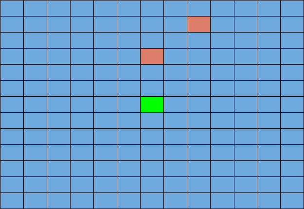

## Project Summary

In the first working implementation of StevesFightClub, the agent will only use a sword to fight at most two zombies at a time. The agent can attack, strafe left/right, walk forwards/backwards, and turn around. The agent currently takes into consideration nearby enemies, but future implementations could consider the type and health of the enemy.


## Approach

##### Environment



We started by building a world as a 13x13 enclosed arena. We spawned two zombies near the agent. Using the hit_test.py and tutorial files, the agent was able to aim at the zombies and attack. At this time, our agent was only able to attack. It was not able to move and therefore would be attacked as he stood still and fought back. 

##### Learning Algorithm

The next version of our agent included a simple Q table approach. Our current Q table update as follows:

```
old_q = q_table[prev_s][prev_a]
new_q = old_q + alpha * (reward + gamma * max(q_table[current_state]) - old_q)
```

The states, which we detail below, are very general states; however, there is still some overlap between different states (i.e. if a mob is close, there might be some actions the agent should prefer to take regardless of its position).  The way the update function is now, two different states will have completely different learning, independent of each other.  We hope to improve the update function by "leaking" the well rewarded actions to other similar states, at some rate we can control.  For example, if the agent achieves a high reward for attacking when a mob is close, this high reward can be applied to other slots of the Q table that also have the mob close.  This will potentially increase the rate at which the agent can learn.

##### States
Initially we implemented the state as the whole number x and z positions, which we obtained by truncating the float values from the player position observation provided through Malmo.  We chose to truncate the positions so that the agent would have an effectively infinite number of states to be in (i.e. x = 5.0001 and x = 5.0000 are completely different states otherwise).  The aim was to have the agent learn what to do based on its position in the arena.  However, in practice the number of states were much too high.  The agent would be travelling through different positions in the arena every iteration of the learning algorithm, effectively making learning general policies impossible.  


Therefore we decided to simplify the number of states, making it depend on the nearness of the enemies.  The logic is that, because of the random actions that both the agent and the mobs can take, the difference between being in say position (7,7) and (7,8) is almost nonexistent. Instead, if the agent learns what to do based on how near or far enemies are, it will much more likely end up learning to kite back and forth.  In fact, to test the simplified state we made the state simply between near ( < 3 blocks away), or far (>= 3 blocks away).  Running this state heuristic resulted in an agent that would learn when and how often to attack as it approached the end of its iteration cycles.

This leaves the question of how the size and shape of the arena can come into play.  Based on the above mentioned state heuristic, there is no way for the agent to differentiate between fighting mobs in the middle of the arena and in a corner of the arena (except for if there is a clear pattern of movement that the mobs will take, which we found no evidence of).  We already tried to make the state based on the agent's position in the arena, so that is most likely not going to work.  We theorize it would be better to instead differentiate between the states of not being surrounded by walls, having a wall nearby, and having a corner nearby.  This can be accomplished by using information about the size and shape of the arena.  For our experimentation, we use a 13x13 arena.  If we know the length and width, as well as the general shape of the arena (rectangular), we can create a simple function that takes the agent's position and creates a state based on whether it is in a corner tile, a wall tile, or any other tile.  While the agent's state is not implemented this way at the time of writing this, it is definitely something to look to implement correctly as a next step in this project.

##### Actions
This version includes the following actions:
- attack
- move forward
- move left
- move right
- move back

Here we have all the actions that the agent can take.  The possible actions are all weighted equally in the beginning.  As you can see, movement is represented more than attacking (4 movement options vs 1 attack option).  If we see fit, this can be modified through several ways.  We can introduce weighting in the random selection of actions, or we could introduce more copies of attack options in the action pool.  Of course, this would mostly effect the first few iterations of the agent, because the agent will eventually start weighing each action based on the results it gives.

##### Rewards

The rewards include:
- -1000 for agent death
- +100 for damaging an enemy
- -1 for any action

The agent has a 0.3 chance of choosing a random action and a 0.70 chance of choosing an action from the Q table. We reduce the epsilon over time. As it approaches 200 episodes, the epsilon will reduce to 0. Below shows the output of the random and q table actions chosen.

We are currently experimenting with rewarding the agent more for completing tasks faster. For example, we can include a +1000 reward if the agent defeats all the enemies and completes the mission early and  a -5 reward if the agent runs out of mission time. We need more testing in order to evaluate this approach.  Another thing that we are considering is to weigh the penalties for taking different actions differently. For example, we could change the reward for taking an attack action to -10 or even -50 instead of the baseline -1 we already have.  Logically this would make the agent more reserved about repeatedly attacking the air.  We hope to not simply make an agent that only presses attack, and this could be a step in the right direction.


## Evaluation

Before the inclusion of Q-learning, the agent would repeatedly attack with a sword even when the enemies were not in range. However, with the Q table, the agent was strategically attacking when the enemies were in attackable range. The agent was quickly able to learn this after a couple iterations. The agent would also prioritize on attacking the closest enemy. The agent would choose the option to attack when there is an opportunity, so prioritizing the closest enemy would most likely provide it with the reward of damaging the enemy. The movement of the agent is still quite sporadic. Hopefully, this will be improved by taking into consideration more state information.


The graphs indicate the total rewards of each episode. The x-axis represents the episode and the y-axis represents the reward of that episode. The left graph is based on the map generated in our initial approach. Observe that the reward increases as the number of episode increases. This is most likely due to the fact that the agent is taking Q table moves more than random moves as it approaches 200 episodes. On the other hand, the right graph is a newly generated map shown below:


Once the zombie spawn positions changed, the rewards do not improve over the course of 200 episodes. The enemies are placed in front and behind the agent where both enemies are equidistant to the agent. The agent will have difficulty locking on to one enemy. This is confirmed by observing the agent over several episodes. It would spin repeatedly and switch between the two targets. This results in the agent occasionally missing attacks, taking damage, and consequently dying. 


## Remaining Goals and Challenges

- [ ] A wider variety of enemies
- [ ] A baseline to compare performance
- [ ] More weapons such as bows, arrows, and shields


One of the challenges encountered was when the agent backed itself into the corner of the arena and was surrounded by enemies. The agent does not have anyway of knowing the surrounding blocks, and this situation usually led to the agent's death. 
A solution could be to increase the arena size, but this may result in the agent running away to avoid damage/death. We could implement a way for the agent to find out about its surroundings so when it retreats, the agent will learn that retreating into a corner can lead to a bad reward.


## Resources Used

Malmo Python examples: the tutorials, tabular_q_learning.py, hit_test.py, and mob_fun.py
